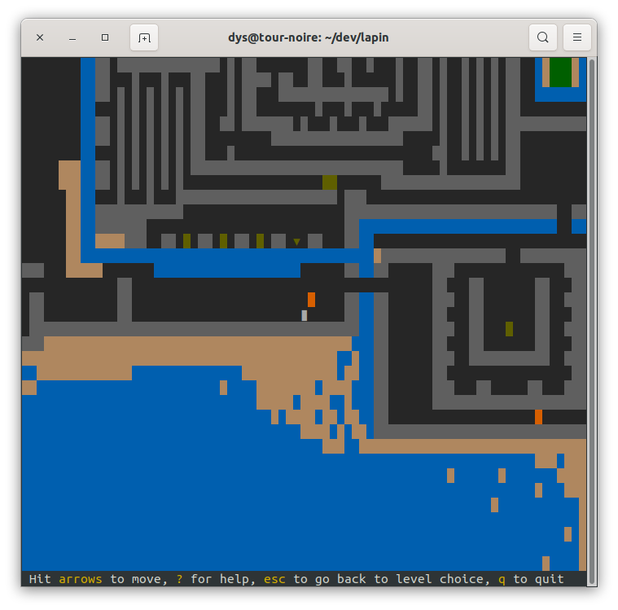
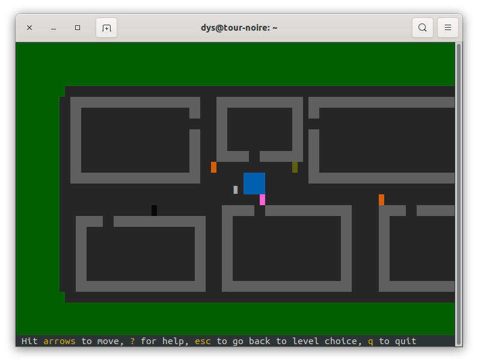
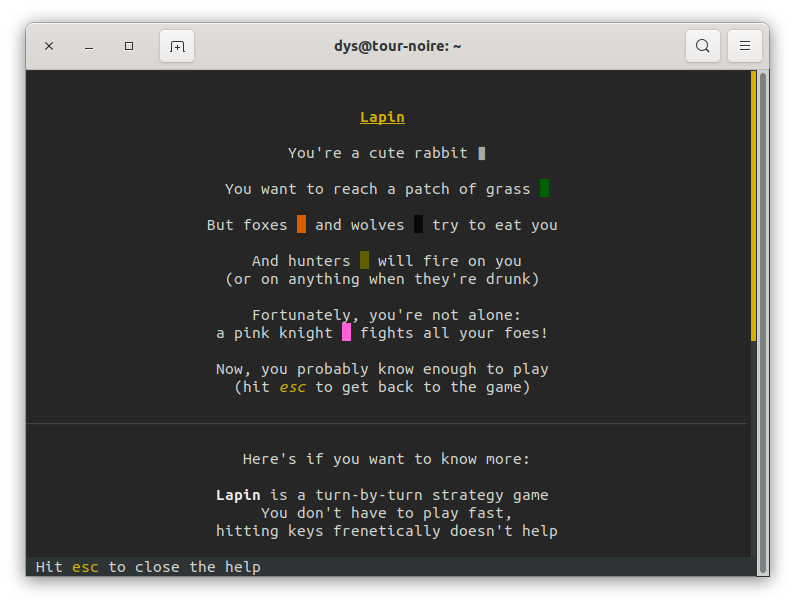
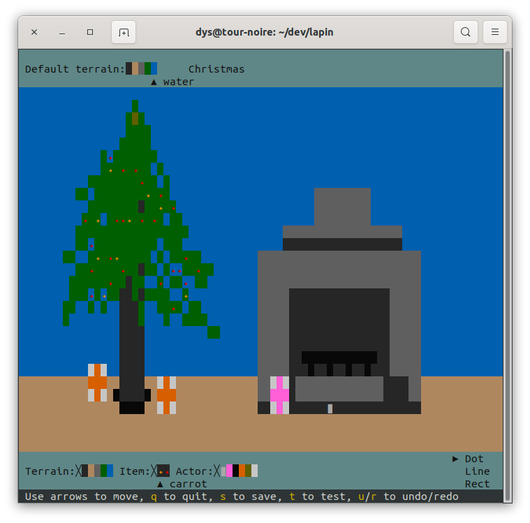

# lapin

[![Chat on Miaou][s1]][l1]

[s1]: https://miaou.dystroy.org/static/shields/room.svg
[l1]: https://miaou.dystroy.org/3

A game in which you move a rabbit trying to reach grass without being eaten or fired at.

## Get Lapin

### From source:

You need the rust toolchain, which is best installed through https://rustup.rs

Clone this repository, then run

    cargo install

### From a precompiled executable

You may download them on https://dystroy.org/lapin

### Compatibility

Lapin is assumed to

* work on most terminals on linux and mac
* *not* correctly work on Windows (it should probably be playable with the right terminal and fonts but I can't test myself)

## Play the included campaign

Just start

    lapin

then choose the level you want to play.

Use the arrow keys to try move your Lapin (rabbit) to a patch of green grass.

It's better to have one unix account per player as the game remembers what levels have been won.

## Get help

Type `?` at any time to get the help screen:

Your kids don't need to read it: they'll remember the rules if you explain them once.

## Play another campaign or level

If you downloaded another file, you may do

    lapin play that-other-file.mpack

## Create a level

To create a level, do

    lapin edit your_new_file.mpack

To edit it later, use the same command.

The level editor is basically a paint program where the ink can be made of foxes, water, etc. You may also click on the name to change it.

Note: Lapin understands JSON and MessagePack (mpack) formats. When you want to manually edit a file, the JSON format is more convenient. The MessagePack one is more compact.

## Create a campaign

Do

    lapin campaign create my_campaign.json

to create a new empty campaign. It's a clear JSON file you'll manually edit to reference level files (just put their name, for example "sapin" when you have a "sapin.mpack" level file in the same directory).

## Pack a campaign

You don't have to distribute your campaign as a bunch of files. You may pack it, which embeds both the index and the levels into one unique file. You do so by running

    lapin campaign pack my_unpacked_campaign.json my_new_packed_campaign.mpack

(it would be possible but pointless to use JSON for the packed campaign too)

## Discuss or contribute

If you or your kids like the game, please come to [Miaou](https://miaou.dystroy.org/3) and tell me.

If you want to discuss the code or improve it, you're welcome too!
